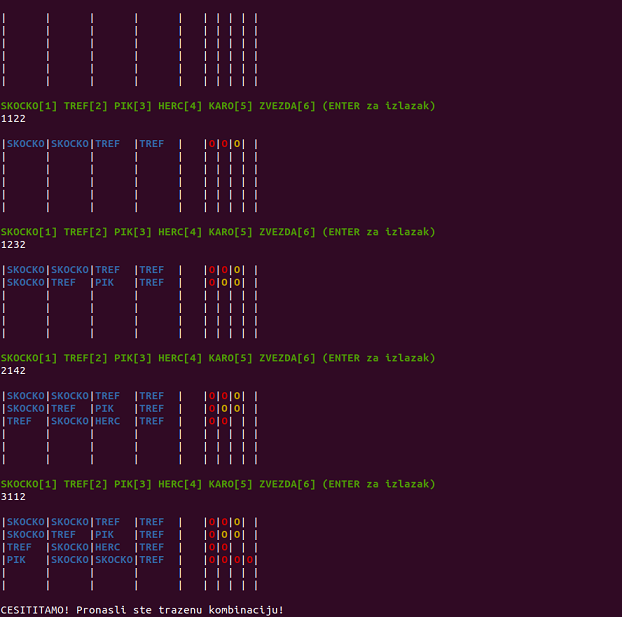

# i386-assembly-mastermind-game
Mastermind game coded in i386 assembly language. It uses only one 32 bit register to store the combination.

<p align="center">
  
</p>

## Assembly
To convert the code into executable machine code with gcc by using the following command:

```gcc mastermindV2.S -m32 -o mastermindV2.out```  

## Running the program
To run the program on linux use the following command:

```./mastermindV2.out```
## About the program
Important note about the functions in the program is that the program doesn't respect the CDECL calling convenction to reduce the number of operations that would result from storing the parameters on the stack and saving the values of register. The consequence is that the code used for taking the input and printing the output is repeated six times. Idea was to optimise the execution time of functions and not worry about the size of the code for user input and output.
### Storing combinations
<p>
  This program uses only one 32bit register to store the combination. There are six signs that are used in this game
so only six bits are needed to encode one sign. Since 32bit register can be divided into four 8 bit sections, each 
these sections can than hold information about the sign. This way the whole combination that consists of four signs
can be stored inside just one register.
</p>

### Reading from the registers
<p>
  To read the sign from the register and compare it to the signs in the targeted combination that the person is trying to guess, the rotation operation is used in combinations with bit masks. This program tries to optimise the usage of registers by storing masks and all other possible data needed in the higher and lower 8bit parts of registers. This way different parts of 32bit register can be used to store different data.
</p>
<p>
  Benefit is that masks and other values other than the combinations can be loaded only once at the start of the function. There are 1296 possible combinations that are generated, and they are loaded from memory one by one to compare them to the correct combination.
</p>

### Determining the numbers of correct sign placements
<p>
  Histogram that represents correct signs at the right places and correct signs at the wrong places is created by comparing the users guess to the correct combination, and then all the remaining possible combinations are compared to the guess. Those combinations that do not mach the histogram are eliminated.
</p>

### End condition
<p>
    Game ends when either user guesses the correct combinations, when six incorrect guesses are attempted or when the user types enter to exit the program.
</p>

### Number of remaining combinations
<p>
  There is also a function that determines the number of remaining combinations that is currently not used, but the is needed if alternative scoring rules are to be implemented, where the score would start to lower once there is only one possible combination remaining, and the user misses it.
</p>

### Collecting the user input
<p>
  System calls are used to get the user input. Standard checks are performed, and the first four numbers are taken if available. These are then used to create the guess combination.
</p>

### Printing the results
<p>
    Printing is done by calling the C printf function. Parameters with empty string messages are placed on the stack (48 of them, because every row contains 4 signs and 4 correct guess indicators and there are six guesses). And after every guess, apropriate row is updated by manipulating the stack pointer and writing the values directly in the eight targeted stack locations and then the printf functon is called.
</p>
<p>
    Alternatively this could have been achieved by building the string message in the memory, and by writing the parameter values directly into the string message, and then just calling the printf function with the message as the only argument.
</p>

  
