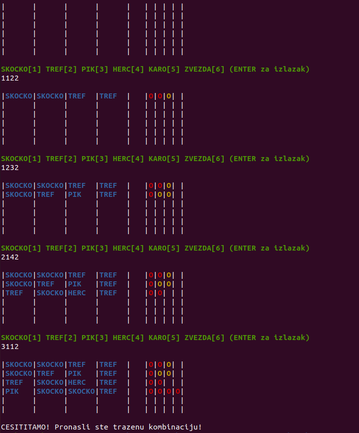

# i386-assembly-mastermind-game
Mastermind game coded in i386 assembly language. It uses only one 32 bit register to store the combination.



## Assembly
To convert the code into executable machine code with gcc by using the following command:

```gcc mastermindV2.S -m32 -o mastermindV2.out```  

## Running the program
To run the program on linux use the following command:

```./mastermindV2.out```
